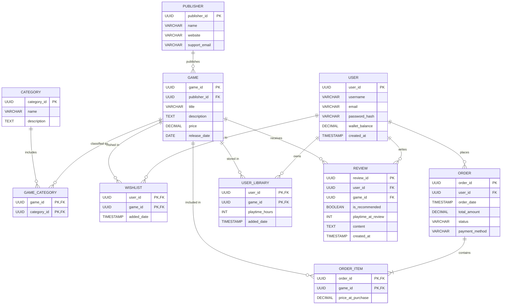

```mermaid
erDiagram
    

    USER {
        UUID user_id PK
        VARCHAR username
        VARCHAR email
        VARCHAR password_hash
        DECIMAL wallet_balance
        TIMESTAMP created_at
    }

    PUBLISHER {
        UUID publisher_id PK
        VARCHAR name
        VARCHAR website
        VARCHAR support_email
    }

    GAME {
        UUID game_id PK
        UUID publisher_id FK
        VARCHAR title
        TEXT description
        DECIMAL price
        DATE release_date
    }

    CATEGORY {
        UUID category_id PK
        VARCHAR name
        TEXT description
    }

    GAME_CATEGORY {
        UUID game_id PK,FK
        UUID category_id PK,FK
    }

    WISHLIST {
        UUID user_id PK,FK
        UUID game_id PK,FK
        TIMESTAMP added_date
    }

    ORDER {
        UUID order_id PK
        UUID user_id FK
        TIMESTAMP order_date
        DECIMAL total_amount
        VARCHAR status
        VARCHAR payment_method
    }

    ORDER_ITEM {
        UUID order_id PK,FK
        UUID game_id PK,FK
        DECIMAL price_at_purchase
    }

    USER_LIBRARY {
        UUID user_id PK,FK
        UUID game_id PK,FK
        INT playtime_hours
        TIMESTAMP added_date
    }

    REVIEW {
        UUID review_id PK
        UUID user_id FK
        UUID game_id FK
        BOOLEAN is_recommended
        INT playtime_at_review
        TEXT content
        TIMESTAMP created_at
    }


    PUBLISHER ||--o{ GAME : "publishes"
    USER ||--o{ ORDER : "places"
    USER ||--o{ USER_LIBRARY : "owns"
    GAME ||--o{ USER_LIBRARY : "stored in"
    ORDER ||--|{ ORDER_ITEM : "contains"
    GAME ||--o{ ORDER_ITEM : "included in"
    USER ||--o{ REVIEW : "writes"
    GAME ||--o{ REVIEW : "receives"
    USER ||--o{ WISHLIST : "adds to"
    GAME ||--o{ WISHLIST : "wished in"
    GAME ||--o{ GAME_CATEGORY : "classified as"
    CATEGORY ||--o{ GAME_CATEGORY : "includes"
```